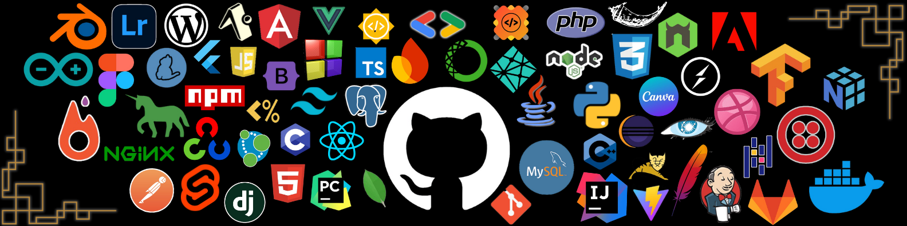

# Hi there, I'm Lungsom Lamnio! 👋

## 🚀 About Me

I'm a **MERN Stack Developer** passionate about building scalable and efficient web applications. I enjoy solving problems, contributing to open-source projects, and exploring innovative solutions for real-world challenges.

- 🌍 **Currently working on:** A **MERN-based chat application** and **AI-powered solutions for smallholder farmers** (Solution Challenge 2025)
- 🎯 **Interests:** Web Development, AI Integration, E-commerce Automation, and Traffic Safety Tech
- 💡 **Hackathon Enthusiast:** Love participating in hackathons and building impactful projects
- 📚 **Currently learning:** **React Native**, **TensorFlow.js**, and **AI APIs**
- 🎸 **New Hobby:** Learning guitar from scratch 🎶

## 🏆 Achievements

- 🥇 **Winner of Launchpad 2024 by Sunstone**
- 🌟 **Google Developers Group (GDG) Web Dev Lead at AdtU**
- 💻 **Finalist in multiple hackathons with projects in AI & Web Development**

## 🔧 Tech Stack

                                                                 

### **IDEs:**

## 🔥 Featured Projects

- 🏡 **[Wanderlust](https://github.com/LungsomLamnio/wanderlust)** - Airbnb-like platform for listing restaurants, hotels, and travel spots.
- 🛍 **[E-Commerce for Local Artisans](https://github.com/LungsomLamnio/ecommerce-artisans)** - A digital platform to support local craftsmen.
- 📡 **[Intelligent Traffic Management System (ITMS)](https://github.com/LungsomLamnio/itms)** - AI-powered traffic control using Google Maps API & IoT.
- 💬 **[PingUp - Chat Application](https://github.com/LungsomLamnio/pingup)** - A WhatsApp-like chat app built using the MERN stack.
- 🌱 **[Plant Disease Detection App](https://github.com/LungsomLamnio/plant-disease-ai)** - AI-powered plant disease detection using TensorFlow.js & Gemini API.

## 📈 GitHub Stats

## 🏆 GitHub Trophies

<picture>
  <source media="(prefers-color-scheme: dark)" srcset="https://raw.githubusercontent.com/tobiasmeyhoefer/tobiasmeyhoefer/output/github-snake-dark.svg" />
  <source media="(prefers-color-scheme: light)" srcset="https://raw.githubusercontent.com/tobiasmeyhoefer/tobiasmeyhoefer/output/github-snake.svg" />
  
</picture>

## 📫 Connect with Me

---

### ✍️ Random Dev Quote

