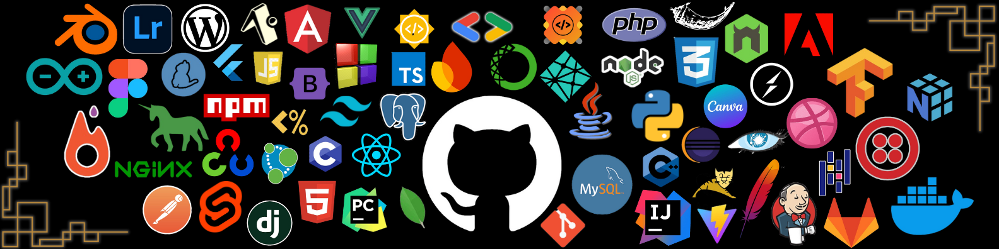

  

  I am a 6th-semester B.Tech Computer Science & Engineering student at Assam down town University and a high-achieving developer with a <b>10 SGPA</b> and the <b>Sunstone Pride (Student of the Year)</b> award. Currently, I balance strategic leadership as the <b>Chief Technical Officer (R&D) at Vernovate Pvt. Ltd.</b> with community impact as the <b>Technical Lead for GDG on Campus</b>. Specializing in the MERN stack and Android (Kotlin), I am also deepening my expertise in AI and Natural Language Processing. As an active competitive programmer and open-source contributor, I am currently architecting <b>ReacTalk</b>, a real-time chat application, while preparing for <b>GSoC 2026!</b>

---

   
  <h2 align="center">Technologies & Tools I Work With</h2>

### 💻 Programming Languages
       

### 🎨 Frontend Development
       

### ⚙️ Backend & Mobile
    

### 🧠 AI/ML & Databases
     

### ☁️ DevOps, Tools & Cloud
      

---

   
  <h1>Let’s Connect!</h1>

  

    
    
    
    
    
  

---

| 📈 **GitHub Stats** | 🔥 **Contribution Streak** |
| :---: | :---: |
|  |  |

 

---

  <h1>Today's Inspiration</h1>
  
  
    
  
  <b>Visitor Count</b>
  

    
  

 

  <picture>
    <source media="(prefers-color-scheme: dark)" srcset="https://raw.githubusercontent.com/tobiasmeyhoefer/tobiasmeyhoefer/output/github-snake-dark.svg" />
    <source media="(prefers-color-scheme: light)" srcset="https://raw.githubusercontent.com/tobiasmeyhoefer/tobiasmeyhoefer/output/github-snake.svg" />
    
  </picture>

 

